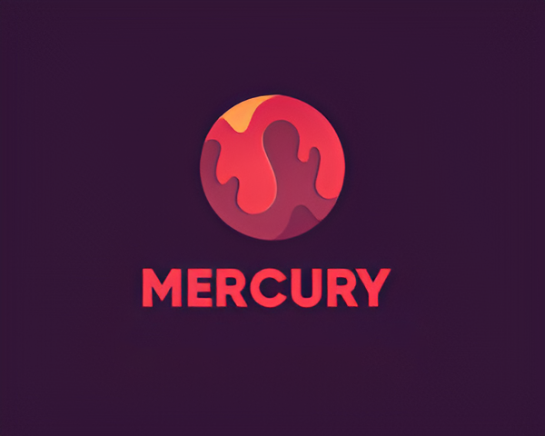

# Mercury


**Mercury - is a progressive and functional asynchronous bot  for Discord, allowing you to turn on music and search for information on the Internet without leaving Discord**



## Functions:

* *play [url link] - A link to a YouTube video is entered, after which the bot goes to the channel and starts playing it
* *turn [something promt] - The user enters *turn and the name of the song and the bot searches for that song and plays it.
* *pause - Stops playback
* *resume - Restores playback
* *stop - Kicks the bot out of the channel
* *write [something promt] - A query is entered, after which the bot displays the first links that match your query
* *perp [something promt] - The user enters *perp and some query, after which the bot sends a link to the perplexity website immediately with the user's query.
* *deep [something promt] - A query is entered, after which the bot accesses deepseek-r1 using deepseek.py and through it enters the query and gives the answer to the chat
* *next - If you have a queue of tracks, this function switches to the next track in the queue. 

## Terms: 

`main.py:`

```
def run():
    ...
    TOKEN = 'YOUR_TOKEN_FROM_DISCORD_SERVICE' 
    ...
```
You can get it from discord developers

`deepseek.py:`
```
API_KEY = "YOUR_API_KEY"  
MODEL = "deepseek/deepseek-r1"
```

You can get it from openrouter.ai. But keep in mind that the key works for free only for the first time

#### The file with main.py should contain:
1. ffmpeg.exe - Needed for converting, capturing, streaming and other operations with multimedia files.
2. deepseek.py - Serves to contact deepseek for further work


## For ffmpeg.exe:

download link: https://www.ffmpeg.org/download.html

   
